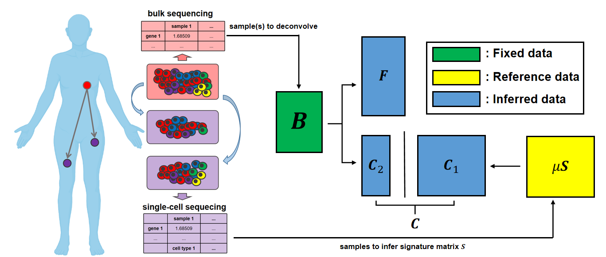
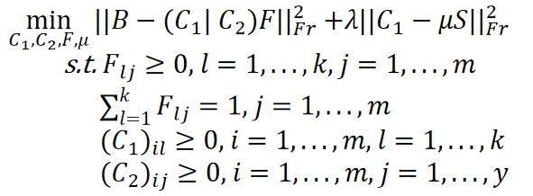

# RADs

## Introduction
RADs stands for Robust and Accurate Deconvolution with Single-cell data. It is an improved method based on our previous publication and take advantage of the single-cell RNA-seq information to infer the cell type profiles in bulk tumor sample(s).

The high level idea of to combine bulk and single-cell RNA-seq data is as shown as below:



In a mathematic way, we would like: Given a non-negative bulk RNA expression matrix B \in R_+^{m x n}, where each row i is a gene, each column j is a tumor sample, our goal is to infer an expression profile matrix C \in R_+^{m x k}, where each column l is a cell community, and a fraction matrix F \in R_+^{k x n}, such that:

  B ~= C F. 

  In the meanwhile, we use single-cell data from metastases as reference and allow unknown cell type(s) that only exist in primary tumor. The overall problem is shown as:

  

  C_1 is the known cell types in metastatic tumor, C_2 is the unknown cell type only in primary tumor, (C_1|C_2) means horizonal stack of these two gene expression in matrix manner

Compared to other method, RADs has at least two advantages:
- it can work on small number of tumor samples, which is usually difficult or impossible for other methods
- it can infer additional information about the primary tumor, while other methods that use reference can only infer information (e.g. cell types) in the reference used
### Functions ###
The main solver is contained in the `sRAD_v3.py`, there are five main functions:
- **_quad_prog_BCmu2F**: solve F by fixing C
- **_quad_prog_BFmu2C1**: solve C_1 by fixing F, \mu and C_2 (if there is any)
- **_quad_prog_BFmu2C2** (if necessary): solve C_2 by fixing C1, F and \mu
- **_linear_reg_mu**: solve \mu using Least sqaure
- **_rna_coordescent**: include the previous function in a coordinate descent algorithm.

For details, please refer to the Section 2.2 in the paper
## Installation

1. Users should clone the git repository, plossibly by typing:
`git clone https://github.com/CMUSchwartzLab/RADs.git`
Instructions in this `README` assume a GNU Linux command line or a Macintosh terminal. The git command above will create a subdirectory named `RADs`. The instructions assume that the user's current directory is `RADs/code`

2. The setup assumes that the user will put the data in another subdirectory under `RADs` (e.g., `RADs/simulated_data`). It is inherent to the code and documentation that the three subdirectories {code, simulated_data, results} are parallel, at the same level. The file structure would be as follows:
 ```
    /some/path/to/RADs
                /simulated_data (or data): where the tested data are put
                /code: the main codes to solve the deconvolution problem
                /results: the results would be saved here
  ```

3. The scripts in that end in .py must be run using **python3**, not python2. The problem was stated as a Quadratic Programming and solved using [CVXOPT](https://cvxopt.org/) in Python, you may install the package first by using 
  ```conda install -c conda-forge cvxopt``` or ```pip install cvxopt```
4. Run the solver: The main code to solve the deconvolution problem is contained in `run_exp_v3.py`, we use this file as the main function to test our model on the simulated data, there are mainly four arguments for the function: `b_noise, s_nosie, sample_nums, lambda`. While `b_noise` and `s_noise` are two parameter to simulate the noise in the data at two different levels (please refer to Section 2.3 for details), `sample_nums` and `lambda` refer to number of bulk sample and regularization term for `||C_1-\mu S||_{Fr}^2` in the objective, respectively. Please note that there is a pre-defined parameter called `date` around `Line 18`, which we used to mark different test for the data, users can use whatever value for `date`, but just put the data into a folder has the same value as `date` under `RADs\simulated_data`. 
A sample command to run the code would be:
    ```
    run_exp_v3.py 0.0 0.0 1 0.1
    ```
    where `0.0 0.0` mean the level of `b_noise` and `s_noise`, `1` means the number of bulk sample, `0.1` means the value of `lambda`.
    When the problem was solved, a single `pickle` file would be generated and saved in `results` directory:
    ```
    RADs\results\result_0.0_0.0_1_0.1.pickle
    ```
    This `pickle` file has a dictinary-like structure and all the inferred results such as inferred C, inferred F and inferred mu will be stored, as well as the ground truth from simulated data. Please note, if `date` has been defined and used, the result path would be:
    ```RADs\results\{date}\result_0.0_0.0_1_0.1.pickle```.
5. Test on real data: `run_exp_v3.py` is mainly for testing the performance of the model on simulated by varying different parameters. Once the optimal parameter (e.g., `lambda`) was determined for a dataset, we provide another code `testreal.py` for the real data. The command would be just as simple as:
    ```
    testreal.py /path/to/real_data
    ```
    then, the result would be stored in 
  ```/RADs/results/real/real_data.picke```
  Users can also modify the `main` function to accomodate their needs to read and save the data.
## Tutorial
While the real data is not able to share at this moment, we provided a simulated data based on the real data as well as jupyter notebook `tutorial.ipynb` in the `code` directory for users to better understand the tool